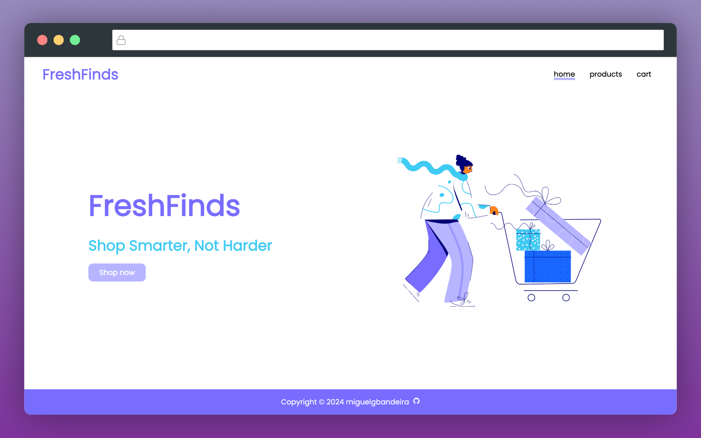

# FreshFinds

[](https://shopping-cart-dw2.pages.dev/)

## About this app

This web app is a mock e-commerce store, serving as a practice exercise aimed at mastering React Router, Prop Types validation, and CSS-in-JS using Emotion.

## Demo

You can view a live demo of the app [here.](https://shopping-cart-dw2.pages.dev/)

## Technologies Used

- React
- React Router
- Emotion
- Prop-types
- CSS
- Cloufare (to deploy the app)

## How to Use

- Clone the repository using ```git clone https://github.com/miguelgbandeira/shopping-cart.git```or downloading the files
- Have node installed on your machine.
- Run ```pnpm install```
- Run ```pnpm dev```
- Open ```http://localhost:5173/``` in your browser.
